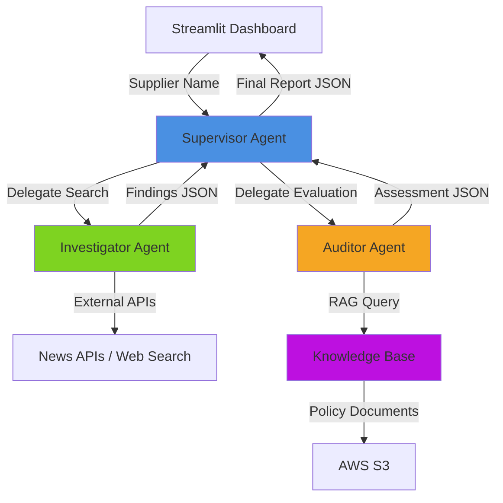

# Design Document

## Overview

Sentinel is a multi-agent AI system built on AWS Bedrock that automates supplier ethical compliance auditing. The system employs a hierarchical agent architecture where a Supervisor Agent orchestrates two specialized worker agents: an Investigator Agent that gathers external intelligence, and an Auditor Agent that evaluates findings against internal policies using Retrieval-Augmented Generation (RAG).

The system processes supplier names through a Streamlit web interface, executes parallel intelligence gathering and policy evaluation, and returns structured risk assessments with evidence-based findings in under 30 seconds. All inter-agent communication uses validated JSON schemas to ensure data integrity and reliable parsing.

## Architecture

### System Architecture Pattern: Hierarchical Multi-Agent (Supervisor Pattern)



### Component Layers

1. **Presentation Layer**: Streamlit web application providing user interface
2. **Orchestration Layer**: Supervisor Agent coordinating workflow
3. **Intelligence Layer**: Investigator Agent gathering external data
4. **Compliance Layer**: Auditor Agent evaluating against policies
5. **Knowledge Layer**: AWS Bedrock Knowledge Base with RAG capabilities
6. **Storage Layer**: AWS S3 for policy documents and audit logs

### Technology Stack

- **AI Framework**: AWS Bedrock Agents (Claude 3.5 Sonnet)
- **Knowledge Base**: AWS Bedrock Knowledge Base with vector embeddings
- **Frontend**: Streamlit (Python)
- **Backend**: Python 3.9+
- **External Tools**: AWS Lambda Action Groups for custom integrations
- **Storage**: AWS S3 for documents and logs
- **Security**: AWS IAM for access control, encryption at rest and in transit

## Components and Interfaces

### 1. Supervisor Agent

**Responsibility**: Orchestrate the complete audit workflow and format final reports

**Inputs**:
- `supplier_name: str` - Name of supplier to audit

**Outputs**:
- `AuditReport` - Structured JSON containing risk scores, findings, violations, and recommendations

**Behavior**:
1. Receive supplier name from UI
2. Invoke Investigator Agent to gather external intelligence
3. Invoke Auditor Agent with findings for policy evaluation
4. Aggregate results and calculate overall risk score
5. Format final JSON report for UI consumption
6. Handle errors from worker agents gracefully

**Error Handling**:
- If Investigator fails: Return partial results with warning
- If Auditor fails: Return findings without policy evaluation
- If both fail: Return error message with retry suggestion
- Timeout after 30 seconds with partial results

### 2. Investigator Agent

**Responsibility**: Gather external intelligence about suppliers from public sources

**Inputs**:
- `supplier_name: str` - Name of supplier to investigate

**Outputs**:
- `InvestigatorFindings` - JSON containing list of findings with sources and dates

**Behavior**:
1. Search external sources for supplier-related news
2. Query for labor violations, environmental issues, ethical concerns
3. Extract structured data: date, source, snippet, category, URL
4. Return findings in standardized JSON format

**External Tools**:
- News API integration (via AWS Lambda Action Group)
- Web search capabilities
- NGO report databases

**Search Categories**:
- Labor: worker rights, strikes, unsafe conditions, wage violations
- Environment: pollution, fines, sustainability issues
- Ethics: corruption, fraud, governance failures

### 3. Auditor Agent

**Responsibility**: Evaluate findings against internal compliance policies using RAG

**Inputs**:
- `InvestigatorFindings` - Findings from Investigator Agent

**Outputs**:
- `AuditAssessment` - JSON containing violations, severity scores, and risk levels

**Behavior**:
1. Receive findings from Supervisor
2. For each finding, query Knowledge Base with RAG
3. Determine if finding violates Supplier Code of Conduct
4. Classify evidence type (Allegation vs Proven Violation)
5. Assign severity level (Minor, Major, Critical)
6. Calculate category risk scores (Labor, Environment, Ethics)
7. Generate actionable recommendations

**Knowledge Base Integration**:
- Query format: "Does [finding snippet] violate our policy on [category]?"
- Retrieve relevant policy sections with similarity search
- Use LLM reasoning to determine violation status
- Return policy references for transparency

### 4. Knowledge Base

**Responsibility**: Store and retrieve organizational ethical policies for RAG queries

**Contents**:
- Supplier Code of Conduct
- Labor rights policies
- Environmental standards
- Ethical governance requirements

**Implementation**:
- AWS Bedrock Knowledge Base with vector embeddings
- Documents stored in S3
- Automatic chunking and indexing
- Semantic search with relevance scoring

**Query Response Time**: < 5 seconds per query

### 5. User Interface (Streamlit Dashboard)

**Responsibility**: Provide intuitive web interface for supplier auditing

**Features**:
- Supplier name input field
- "Run Audit" button to initiate workflow
- Traffic light risk indicator (Red/Yellow/Green)
- Risk breakdown by category with progress bars
- Evidence listing with expandable details
- Violation display with severity indicators
- Actionable recommendations
- Raw JSON report viewer for debugging

**Visual Design**:
- Clean, professional interface
- Color-coded risk levels
- Responsive layout with columns
- Loading indicators during processing
- Error messages with clear guidance

## Data Models

### AuditReport (Final Output)

```json
{
  "supplier": "string",
  "timestamp": "ISO 8601 datetime",
  "overall_risk": "GREEN" | "YELLOW" | "RED",
  "risk_scores": {
    "Labor": 0-100,
    "Environment": 0-100,
    "Ethics": 0-100
  },
  "findings": [Finding],
  "violations": [Violation],
  "recommendations": ["string"]
}
```

### Finding (Investigator Output)

```json
{
  "date": "YYYY-MM-DD",
  "source": "string",
  "snippet": "string",
  "category": "Labor" | "Environment" | "Ethics",
  "url": "string"
}
```

### InvestigatorFindings

```json
{
  "supplier": "string",
  "findings": [Finding]
}
```

### Violation (Auditor Output)

```json
{
  "finding": Finding,
  "severity": "MINOR" | "MAJOR" | "CRITICAL",
  "policy_reference": "string",
  "evidence_type": "ALLEGATION" | "PROVEN"
}
```

### AuditAssessment

```json
{
  "overall_risk": "GREEN" | "YELLOW" | "RED",
  "risk_scores": {
    "Labor": 0-100,
    "Environment": 0-100,
    "Ethics": 0-100
  },
  "violations": [Violation],
  "recommendations": ["string"]
}
```


## Correctness Properties

*A property is a characteristic or behavior that should hold true across all valid executions of a system—essentially, a formal statement about what the system should do. Properties serve as the bridge between human-readable specifications and machine-verifiable correctness guarantees.*

### Property 1: Audit workflow initiation
*For any* valid supplier name submitted through the interface, the system should initiate an audit workflow that invokes both the Investigator and Auditor agents.
**Validates: Requirements 1.1, 4.1**

### Property 2: Risk score validity
*For any* completed audit, the overall risk score should be exactly one of the three valid values: "GREEN", "YELLOW", or "RED".
**Validates: Requirements 1.3**

### Property 3: Report structure completeness
*For any* audit report, all required fields should be present: supplier name, timestamp, overall_risk, risk_scores (with Labor, Environment, Ethics), findings list, violations list, and recommendations list.
**Validates: Requirements 1.4, 4.4**

### Property 4: Error message presence
*For any* error condition during audit execution, the system should return a non-empty error message to the user.
**Validates: Requirements 1.5**

### Property 5: Violation evidence completeness
*For any* identified violation, the violation object should contain all required evidence fields: source publication name, incident date, and descriptive snippet.
**Validates: Requirements 2.1, 2.2, 2.3**

### Property 6: Finding preservation
*For any* set of findings from the Investigator, all findings should be present in the final audit report with their respective evidence intact.
**Validates: Requirements 2.4**

### Property 7: Evidence classification validity
*For any* violation, the evidence_type field should be exactly one of two valid values: "ALLEGATION" or "PROVEN".
**Validates: Requirements 2.5, 6.4**

### Property 8: Category validity
*For any* finding in an audit result, the category field should be exactly one of three valid values: "Labor", "Environment", or "Ethics".
**Validates: Requirements 3.1**

### Property 9: Violation count accuracy
*For any* audit report, the count of violations per category should equal the actual number of violations in that category within the violations list.
**Validates: Requirements 3.2**

### Property 10: Workflow orchestration
*For any* supplier name, when the Supervisor receives it, the Supervisor should invoke the Investigator first, then invoke the Auditor with the Investigator's findings.
**Validates: Requirements 4.1, 4.2**

### Property 11: JSON schema conformance
*For any* agent output (Investigator findings, Auditor assessment, or Supervisor report), the output should be valid JSON that conforms to its defined schema.
**Validates: Requirements 4.3, 8.4**

### Property 12: Agent failure handling
*For any* agent failure (Investigator or Auditor), the Supervisor should handle the error gracefully and return either partial results or an error message without crashing.
**Validates: Requirements 4.5**

### Property 13: Comprehensive search coverage
*For any* supplier name, the Investigator should perform searches across all three categories: Labor, Environment, and Ethics.
**Validates: Requirements 5.1, 5.2, 5.3**

### Property 14: Finding field extraction
*For any* search result that produces findings, each finding should have all required fields extracted: date, source, snippet, category, and URL.
**Validates: Requirements 5.4**

### Property 15: JSON serialization round-trip
*For any* data structure (InvestigatorFindings, AuditAssessment, or AuditReport), serializing to JSON and then deserializing should produce an equivalent structure.
**Validates: Requirements 5.5, 8.1, 8.2, 8.3**

### Property 16: Knowledge Base query coverage
*For any* set of findings received by the Auditor, the Auditor should query the Knowledge Base for each finding to determine policy violations.
**Validates: Requirements 6.1**

### Property 17: Violation determination
*For any* finding evaluated by the Auditor, the Auditor should make a determination of whether it violates the Supplier Code of Conduct (true or false).
**Validates: Requirements 6.2**

### Property 18: Severity and classification validity
*For any* identified violation, the severity should be one of "MINOR", "MAJOR", or "CRITICAL", and the evidence_type should be one of "ALLEGATION" or "PROVEN".
**Validates: Requirements 6.3, 6.4**

### Property 19: Assessment structure completeness
*For any* Auditor evaluation, the returned assessment should contain all required fields: overall_risk, risk_scores, violations list, and recommendations list.
**Validates: Requirements 6.5**

### Property 20: Knowledge Base query response
*For any* policy query to the Knowledge Base, the Knowledge Base should return relevant policy sections (non-empty result).
**Validates: Requirements 7.2**

### Property 21: Policy update propagation
*For any* policy document update in the Knowledge Base, subsequent queries should return content reflecting the updated policy, not the old version.
**Validates: Requirements 7.3**

### Property 22: JSON validation enforcement
*For any* JSON generation, the system should validate the JSON against its schema, and only valid JSON should be transmitted to the next component.
**Validates: Requirements 8.4**

### Property 23: JSON validation error handling
*For any* JSON that fails validation, the system should log the error and attempt format correction before transmission.
**Validates: Requirements 8.5**

### Property 24: Audit result encryption
*For any* audit result stored to disk or database, sensitive supplier information should be encrypted (not stored in plaintext).
**Validates: Requirements 9.3**

### Property 25: External source failure handling
*For any* external source unavailability, the system should notify the user with an error message and suggest retry options.
**Validates: Requirements 10.2**

### Property 26: Ambiguous name handling
*For any* ambiguous supplier name, the system should request clarification from the user rather than proceeding with uncertain data.
**Validates: Requirements 10.3**

### Property 27: Knowledge Base failure degradation
*For any* Knowledge Base query failure, the system should log the error and return findings without policy evaluation rather than failing completely.
**Validates: Requirements 10.4**

## Error Handling

### Error Categories

1. **Input Validation Errors**
   - Empty supplier name
   - Invalid characters in supplier name
   - Ambiguous supplier name
   - Response: User-facing error message with guidance

2. **External Service Errors**
   - News API unavailable
   - Web search timeout
   - Network connectivity issues
   - Response: Retry suggestion, partial results if available

3. **Knowledge Base Errors**
   - KB query timeout
   - KB unavailable
   - Policy document missing
   - Response: Return findings without policy evaluation, log error

4. **Agent Communication Errors**
   - Investigator agent failure
   - Auditor agent failure
   - JSON parsing errors
   - Response: Partial results, error message, graceful degradation

5. **Data Validation Errors**
   - Invalid JSON schema
   - Missing required fields
   - Invalid enum values
   - Response: Attempt correction, log error, return error message

### Error Handling Strategy

**Graceful Degradation**: System should provide partial results when possible rather than complete failure.

**Error Logging**: All errors should be logged with:
- Timestamp
- Error type and message
- Component that failed
- Input that caused the error
- Stack trace for debugging

**User Communication**: Error messages should be:
- Clear and non-technical for end users
- Actionable (suggest next steps)
- Honest about what failed and what succeeded

**Retry Logic**:
- External API calls: 3 retries with exponential backoff
- Knowledge Base queries: 2 retries with 1-second delay
- Timeout: 30 seconds for complete audit, 10 seconds per agent

**Fallback Behavior**:
- If Investigator fails: Return error, no audit possible
- If Auditor fails: Return findings without policy evaluation
- If both fail: Return clear error message with retry option

## Testing Strategy

### Unit Testing

Unit tests will verify specific examples and edge cases for individual components:

**Supervisor Agent Tests**:
- Test workflow orchestration with mock agents
- Test error handling when agents fail
- Test report formatting with various input combinations
- Test timeout handling

**Investigator Agent Tests**:
- Test finding extraction from mock search results
- Test JSON formatting of findings
- Test handling of empty search results
- Test category assignment

**Auditor Agent Tests**:
- Test violation detection logic
- Test severity assignment
- Test risk score calculation
- Test recommendation generation
- Test handling of empty findings

**Data Model Tests**:
- Test JSON serialization/deserialization
- Test schema validation
- Test field presence validation

**UI Tests**:
- Test supplier name input validation
- Test risk indicator display
- Test findings rendering
- Test error message display

### Property-Based Testing

Property-based tests will verify universal properties across all inputs using **Hypothesis** (Python PBT library). Each test will run a minimum of 100 iterations with randomly generated inputs.

**Configuration**:
- Library: Hypothesis for Python
- Iterations: 100 minimum per property
- Seed: Fixed for reproducibility in CI/CD
- Shrinking: Enabled to find minimal failing examples

**Test Tagging**: Each property-based test will include a comment tag referencing the design document:
```python
# Feature: ethos-chain-auditor, Property X: [property description]
```

**Property Test Coverage**:
- Properties 1-27 as defined in Correctness Properties section
- Each property maps to one or more requirements
- Tests will generate random but valid inputs
- Tests will verify invariants hold across all generated inputs

**Generator Strategy**:
- Smart generators that produce valid domain objects
- Constrained random generation for realistic test data
- Edge case inclusion (empty lists, null values, boundary conditions)
- Invalid input generation for error handling tests

### Integration Testing

Integration tests will verify end-to-end workflows:

- Complete audit workflow from UI to final report
- Agent communication and data flow
- Knowledge Base integration
- External API integration (with mocks)
- Error propagation through the system

### Test Execution

**Local Development**:
```bash
pytest tests/unit/          # Unit tests
pytest tests/property/      # Property-based tests
pytest tests/integration/   # Integration tests
```

**CI/CD Pipeline**:
- Run all tests on every commit
- Fail build if any test fails
- Generate coverage reports (target: 80%+)
- Run property tests with fixed seed for consistency

**Test Data**:
- Mock data for development and testing
- Separate test fixtures for each component
- Realistic supplier names and findings
- Edge cases explicitly included

